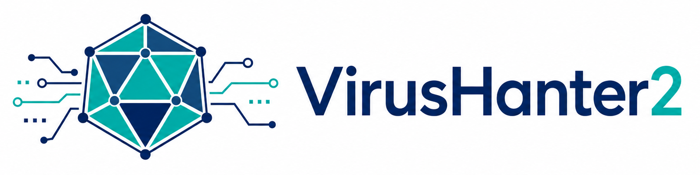

<p align="center">
  
</p>

# virusHanter2

A Snakemake pipeline for viral metagenomics analysis. Paired-end
Illumina reads (typically Twist Comprehensive Virus Research Panel
enrichment) are quality-trimmed, host-cleaned, classified
(Kraken2 + Kaiju), assembled in parallel by MEGAHIT, metaSPAdes and rnaviralSPAdes,
polished with Pilon, annotated (BLASTN, CheckV, optionally
geNomad), and rendered into an interactive HTML per sample plus
tabular per-batch and per-(sample, virus) summaries.

`virusHanter2` is the modular refactor of the original
`virusHanter` monolith; HTML rendering is delegated to the
[`reportHanter`](../reportHanter) package. All classifier and
BLAST outputs are canonicalised to **ICTV-binomial species
names** via NCBI's taxdump (e.g. `Lymphocryptovirus humangamma4`
in place of `human gammaherpesvirus 4` and `Human herpesvirus 4
type 2`), with the legacy NCBI scientific name plus every
non-scientific NCBI alias (acronym, common name, equivalent
name) carried alongside in an `aliases` column so the
report can still surface `EBV`, `Epstein-Barr virus`,
`HHV-4`, etc. for scientist recognition.

## Quick start (Linux)

```bash
# 1. driver environment — only snakemake itself needs to be on PATH
#    before the first run; every per-rule tool gets a fresh conda
#    env materialised under .snakemake/conda/ on first use.
conda create -n virushanter -c conda-forge -c bioconda \
    'snakemake-minimal=9.23.*' mamba
conda activate virushanter

# 2. configure
cp config/config.yaml config/config.local.yaml   # then edit DB paths

# 3. dry-run (DAG check only; no tools invoked)
snakemake -n --sdm conda --configfile config/config.local.yaml

# 4. run
snakemake --sdm conda --cores 8 --configfile config/config.local.yaml
```

`snakemake-minimal` is pinned to match what the `reporthanter`
rule env carries, so Snakemake's `script:` directive does not hit
pickle-version mismatches across the driver / per-rule envs.

## Full-feature run

```bash
conda activate virushanter

cat > config/config.prod.yaml <<'YAML'
SAMPLES:        "/data/runs/<run_id>"
RESULTS_FOLDER: "/data/results"
THREADS: 16

# Reference databases — see docs/REFERENCE_DBS.md for sources and
# docs/REFRESH_TUTORIAL.md for the snapshot-aligned rebuild workflow.
HUMAN_INDEX:   "/refs/bwa/human_gencode"
KAIJU_DB:      "/refs/individual_virus_fasta/kaiju_refseq_viral"
KRAKEN_DB:     "/refs/kraken2/k2_viral_<YYYYMMDD>"
BLASTN_DB:     "/refs/blast/viral_rna_mito"
CHECKV_DB:     "/refs/checkv/checkv-db-v1.5"
VIRUS_PARQUET: "/refs/individual_virus_fasta/all_viruses.parquet"
TAXDUMP_NODES: "/refs/individual_virus_fasta/nodes.dmp"
GENOMAD_DB:    "/refs/genomad/genomad_db"

CONTIG_LENGTH:  500
NUMBER_OF_PLOTS: 10
COVERAGE_WINDOW: 100
PILON_MEM:      "16G"
MEGAHIT_MEM_FRACTION: 0.8

# Multi-assembler mode (default — set to ["MEGAHIT"] for parity).
ASSEMBLERS: ["MEGAHIT", "metaSPAdes", "rnaviralSPAdes"]

# Multi-source coverage selection (default).
COVERAGE_SOURCES: ["KRAKEN", "KAIJU", "BLAST"]
COVERAGE_TOP_N:   20

# Optional stages.
MULTIQC:     "TRUE"
DEDUPLICATE: "TRUE"
QUAST:       "TRUE"
GENOMAD:     "TRUE"
YAML

snakemake -n --sdm conda --configfile config/config.prod.yaml    # dry-run
snakemake    --sdm conda --cores 16 --configfile config/config.prod.yaml
```

First-run conda env materialisation is the slow step; subsequent
runs reuse the cached envs under `.snakemake/conda/<hash>/`. Add
`--rerun-triggers mtime` if you want only file-timestamp-based
re-runs.

## Documentation

Long-form documentation lives under [`docs/`](docs/README.md):

| Topic | File |
|---|---|
| **Documentation index** | [docs/README.md](docs/README.md) |
| **Database setup — all 9 databases, sources, build commands** | [docs/DATABASE_SETUP.md](docs/DATABASE_SETUP.md) |
| Pipeline stages, `{assembler}` wildcard, output tree | [docs/PIPELINE.md](docs/PIPELINE.md) |
| Config schema and every opt-in flag | [docs/CONFIGURATION.md](docs/CONFIGURATION.md) |
| Reference databases — production paths, refresh cadence | [docs/REFERENCE_DBS.md](docs/REFERENCE_DBS.md) |
| **Rebuild the classification DBs from one NCBI snapshot** | [docs/REFRESH_TUTORIAL.md](docs/REFRESH_TUTORIAL.md) |
| Per-(sample, virus) CSV schema + multi-run merge | [docs/PER_VIRUS_OUTPUT.md](docs/PER_VIRUS_OUTPUT.md) |
| Parity invariants with the original `virusHanter` | [docs/PARITY_NOTES.md](docs/PARITY_NOTES.md) |
| Local smoke testing | [test/README.md](test/README.md) |
| Project conventions for AI assistants | [CLAUDE.md](CLAUDE.md) |

## Combining multiple runs

```bash
python scripts/merge_runs.py \
    --result-folder /path/to/RESULTS/<batch1> \
    --result-folder /path/to/RESULTS/<batch2> \
    --out-dir /path/to/master/
# writes master_per_sample.csv + master_per_virus.csv
```

## Rebuilding the classification databases

The classification stack (Kraken2 / Kaiju / `VIRUS_PARQUET` / taxdump)
holds together via the NCBI tax_id. Building all four from one
snapshot — and verifying the residual asymmetry via an
`all_viruses_vs_kraken2.tsv` overlap sidecar — is automated by a
standalone Snakemake workflow under `refresh/`. See
[docs/REFRESH_TUTORIAL.md](docs/REFRESH_TUTORIAL.md) for the
operator workflow.

## Support and licence

Open an issue on the repository for problems or questions.
Licensed under the MIT Licence — see [LICENSE](LICENSE).
